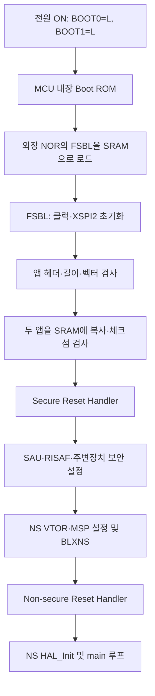

# STM32N6570-DK 펌웨어 기초 프로젝트

외장 NOR에서 부팅한 뒤 Secure/Non-secure 프로그램을 내부 SRAM으로 로드해 실행하는
LRUN 기반 프로젝트다. 2026-10-03 전원 재인가만으로 LED2가 깜빡이는 독립 부팅을 검증했다.
일반 기능 개발은 **AppliNonSecure**에서 시작한다.

## 부팅 순서와 빌드 순서는 다르다



FSBL은 ROM을 수정하는 프로그램이 아니다. Boot ROM이 NOR의 FSBL을 먼저 로드한다.
FSBL의 `main()`은 두 앱을 검증하고 SRAM으로 복사한 후 Secure의 Reset Handler로 이동한다.
각 Reset Handler는 해당 앱의 `.data`, `.bss`, 스택을 초기화한다. Secure는 보안 영역을
설정한 다음 Non-secure로 전환한다. NS에서 사용하는 `SystemCoreClockUpdate()`는
Secure Gateway를 통해 Secure가 계산한 코어 클럭을 가져온다.

**빌드는 Secure → Non-secure 순서가 필수**다. Secure 빌드가 생성하는
`secure_nsclib.o`에 NS가 호출할 실제 진입 주소가 들어 있다. Secure 코드가 바뀌면 주소도
이동할 수 있으므로 NS를 다시 링크하고 두 앱을 함께 배포한다. FSBL은 그 둘보다 먼저
빌드해도 되며, 부팅 순서 자체를 바꾸지는 않는다.

## 어느 프로젝트를 수정하는가

| 디렉터리 | 역할 | 수정하는 경우 |
| --- | --- | --- |
| `AppliNonSecure/Core` | 일반 앱, main 루프, NS 인터럽트 | 센서 처리, 통신, 제어, 추론 등 실제 기능 개발 |
| `AppliSecure/Core` | SAU/RISAF, 보안 자원, NSC API, NS 진입 | NS 주변장치 권한 추가, Secure 서비스 구현, 보안 분할 변경 |
| `FSBL/Core` | 부팅 클럭, XSPI NOR 읽기, 앱 검증·복사·진입 | Flash 배치/이미지 형식 변경, 부트 로더 개선 |
| `Secure_nsclib` | 사람이 관리하는 Secure API 헤더 | 새로운 NSC 함수의 선언 공유; 생성된 `.o`를 여기에 복사하지 않는다 |
| `Drivers` | 공용 STM32 HAL/CMSIS | 보통 그대로 사용. FSBL도 공용 XSPI HAL을 링크한다 |
| `ExtMemLoader` | CubeMX가 만든 별도 다운로드 로더 프로젝트 | 현재 배포에는 사용하지 않는다. ST 제공 `.stldr` 사용 |
| `Firmware/baseline` | 독립 부팅 검증된 바이너리와 복구 이미지 | 기초 상태 복구. 일반 빌드가 덮어쓰지 않는다 |
| `Tools`, `Tests` | 빌드·배포·검증 절차 | 개발 환경과 테스트 관리 |

Secure와 NS는 다른 CPU가 아니라 같은 Cortex-M55의 서로 다른 보안 실행 상태다.
FSBL도 부팅 이후 계속 앱과 병렬로 동작하는 서비스가 아니다.

기본 개발 흐름:

1. NS `Core/Src/main.c`의 USER CODE 영역 또는 새 모듈에 기능을 추가한다.
2. 해당 GPIO/주변장치가 NS에 허용되어 있는지 확인한다. 필요하면 Secure 초기화에서
   핀 속성과 RIF 설정을 변경한다. 현재 Secure가 LED2 PG10을 초기화하고 NS에 허용한다.
3. NS 인터럽트 핸들러는 NS 프로젝트에 둔다. 외부 IRQ의 대상 보안 상태도 확인한다.
   현재 외부 IRQ는 기본 Secure이며 NS SysTick은 별도로 동작한다.
4. 전체 앱을 빌드·검증하고 두 앱을 함께 다운로드한다. 보통 FSBL은 다시 기록하지 않는다.
5. BOOT0=L/BOOT1=L에서 전원 재인가로 실행한다.

카메라/NPU/DMA 등은 해당 기능의 메모리와 접근 권한, 캐시 정책을 추가 설계해야 한다.
현재 NS D-cache는 진단을 위해 꺼져 있다. DMA/대용량 버퍼를 추가하기 전에 정책을 정한다.

## 현재 메모리 지도

| 이미지 | NOR 저장 주소 | SRAM 헤더 복사 주소 | 실행 Vector | 코드/LMA 최대 | RAM/data | 초기 MSP |
| --- | --- | --- | --- | --- | --- | --- |
| FSBL | `0x70000000` | Boot ROM이 로드 | `0x34180400` | 255 KiB | `0x341C0000` | `0x34200000` |
| Secure | `0x70100000` | `0x34000000` | `0x34000400` | 399 KiB | `0x34064000` | `0x34100000` |
| Non-secure | `0x70180000` | `0x34100000` (Secure alias) | `0x24100400` | 511 KiB | `0x24180000` | `0x24200000` |

실행은 외장 Flash에서 직접 하는 XIP가 아니라 SRAM 실행이다. 외장 Flash 용량만큼
프로그램을 무제한 키울 수는 없다. 링커의 ROM은 실제로 코드/초기화 데이터가 놓일 SRAM이다.
NS의 `0x241xxxxx`와 `0x341xxxxx`는 동일 SRAM2의 보안 별칭이다. NS 코드 공간 끝은
FSBL 실행 영역 바로 앞이므로 배치 변경 시 두 영역의 충돌을 검사한다.

로더 상한은 Secure 이미지 전체 `0x64000`, NS 이미지 전체 `0x80000` 바이트다.
헤더와 정렬 패딩을 포함하며 앱 RAM/data 영역은 덮어쓰지 않는다.
현재 NOR 읽기는 SPI 0x0B/24비트 주소로 첫 16 MiB까지만 지원한다.
Flash 쓰기·지우기는 PC의 ST 제공 external loader가 담당한다.

## 재현 가능한 빌드

Windows **PowerShell 7**, STM32 GNU 14.3.rel1, CubeProgrammer/Signing Tool 2.23.0을 사용한다.
스크립트는 CubeIDE의 생성 makefile과 기존 Debug 객체를 사용하지 않고 모든 소스를 빌드한다.
소스 목록은 각 프로젝트의 Core와 `.project`에 정의된 공용 HAL 링크에서 가져온다.

```powershell
pwsh -File .\Tools\Build-Firmware.ps1
pwsh -File .\Tools\Test-Firmware.ps1 -Bundle .\Build\bundle
pwsh -File .\Tools\Program-Firmware.ps1 -Bundle .\Build\bundle -PlanOnly
```

현재 PC의 설치 위치를 자동 탐색한다. 다른 PC에서는 `ST_GCC_BIN`, `ST_PROGRAMMER_BIN`
환경변수 또는 `-ToolchainBin`, `-ProgrammerBin`으로 각각의 bin 디렉터리를 지정한다.
프로젝트 경로와 ST-LINK 일련번호는 코드에 고정하지 않는다.

출력은 `Build/Debug/<프로젝트>`와 `Build/bundle`에 생성된다. bundle은 세 이미지와
SHA256/주소/크기/벡터 정보를 가진 `manifest.json`으로 구성한다. 실패한 빌드는 manifest를
남기지 않는다. Secure import 라이브러리는 이번 빌드에서 생성한 것을 NS 링크에 사용한다.
이미지 크기·벡터·체크섬과 사용된 NSC 심볼 주소를 검사한다.

현재 기준은 Debug/O0다. Release 최적화와 하드웨어 동작은 별도 검증 후 도입한다.
이 프로젝트의 `-nk` trusted 파일은 STM32 헤더를 갖춘 **인증 없는 개발 이미지**다.
체크섬 검사는 손상 검출이며 암호학적 서명 인증이 아니다.

## 다운로드와 복구

먼저 IDE 디버깅/Programmer 연결을 종료한다. 전원을 끄고 BOOT0=L/BOOT1=H로 바꾼 뒤
다시 켠다. 기본 다운로드는 두 앱만 기록한다.

```powershell
# 두 앱 업데이트: 일반 기능 개발 시 사용
pwsh -File .\Tools\Program-Firmware.ps1 -Bundle .\Build\bundle

# FSBL 변경 시: 이전 부팅 영역 64 KiB를 백업한 후 두 앱과 FSBL 기록
pwsh -File .\Tools\Program-Firmware.ps1 -Bundle .\Build\bundle -IncludeFsbl

# 검증된 기초 이미지로 복구
pwsh -File .\Tools\Program-Firmware.ps1 -Bundle .\Firmware\baseline -IncludeFsbl
```

ST 제공 `MX66UW1G45G_STM32N6570-DK.stldr`를 사용한다. ST-LINK가 여러 개라면
`-SerialNumber`를 지정한다. 이미지마다 다운로드 검증을 수행하고 오류가 나면 즉시 중단한다.
업데이트는 전원 장애에 대해 원자적이지 않으므로 완료된 세트를 배포한 뒤 실행한다.
OTP/option bytes/mass erase는 스크립트에 포함하지 않는다.

완료 후 전원 OFF → BOOT0=L/BOOT1=L → 전원 ON. 디버거 없이 LED1 유지와 LED2 점멸을
확인한다. LED1만으로 앱 실행 성공을 판단하지 않는다. 정지된 디버거에서는 LED2도 멈춘다.
접속 실패 시 개발 부트 상태에서 전원을 완전히 재인가한다. RESET만으로는 복구되지 않은
경우가 있었다. 현재 실행 중인 NS 상태에 디버거가 연결되지 않아도 부팅 실패를 뜻하지 않는다.

## CubeIDE와 디버깅

루트 및 FSBL/AppliSecure/AppliNonSecure의 `.project`를 Existing Projects로 가져온다.
소스 링크를 새로 적용한 기존 workspace는 Refresh 후 Project Clean으로 makefile을 재생성한다.
이 Clean은 빌드 산출물에 한정된다. CubeMX 코드 재생성은 수동 XSPI/보안 설정을 바꿀 수 있으니
다른 작업으로 다룬다. `.ioc`와 변경 diff를 검토하며 동기화한다.

CubeIDE에서 Secure를 먼저 빌드하고 NS를 빌드한다. FSBL Debug launch는 SRAM 시험용이다.
새 FSBL은 SRAM 디버깅으로 확인한 후 NOR에 배포한다. CLI `-s` 성공 메시지만으로
Reset Handler 진입을 확정하지 않는다. 확인은 실제 PC/진단값/LED로 한다.

현재 검증 이미지의 진단 주소 (후속 빌드 후 map에서 재확인):

| 진단값 | 주소 | 정상 |
| --- | --- | --- |
| Secure 단계 | `0x3406402C` | 6 |
| NS 루프 카운터 | `0x2418002C` | Resume 중 증가 |
| NS HAL Tick | `0x24180030` | Resume 중 증가 |
| FSBL 상태 (NS alias) | `0x241C002C` | 7 READY |
| Secure 복사 크기 | `0x241C0038` | 6272 |
| NS 복사 크기 | `0x241C003C` | 3232 |

SRAM2를 NS로 전환한 뒤 FSBL의 Secure alias 심볼 조회값이 0으로 보일 수 있다.
전체 상태값과 Fault 해석은 [BOOT_VALIDATION.md](BOOT_VALIDATION.md)를 참고한다.

## 테스트·커밋 기준

```powershell
# 패키지 형식/범위/체크섬/해시 및 손상·잘못된 슬롯 거부 테스트
pwsh -File .\Tools\Test-Firmware.ps1

# 동일 C 파서와 실제 로더를 mock NOR/SRAM에서 실행 (MSVC Community 필요)
.\Tests\run_fsbl_image_tests.cmd
```

소스·CubeIDE 설정·링커·테스트·도구·검증된 baseline을 커밋한다. Debug/Release/Build 출력은
커밋하지 않는다. 새 기초 릴리스는 하드웨어 독립 부팅을 검증한 이미지 세트를 별도 경로에
보존하고 manifest와 검증 기록을 함께 남긴다. 현재 테스트 범위는 [Tests/README.md](Tests/README.md)에 있다.
